# Large Volume Trading
Author: Mikhail Shatov

## Overview
This project implements Large Volume Trading algorithms: the Volume Weighted Average Price (VWAP) strategy and the Almgren-Kriss optimal execution model. The goal is to demonstrate core program trading mechanics for large orders without more advanced optimizations of the liquidity pool, etc.

## Functional Requirements
- Calculate and execute trading orders according to the VWAP algorithm.
- Implement the Almgren-Kriss optimal execution model:
  - Allow parameterization of risk aversion and execution speed trade-offs.
  - Show comparison of naive VWAP and Almgren-Kriss optimal schedules.
- Market Data Handling: Accept simulated market data as CSV.
- Basic logging of order execution and trading statistics.
- CLI interface for running simulations and outputting results.

## Technical Requirements
- Language: C++20.
- Build: CMake-based build system.
- All code must follow the [Google C++ Style Guide](https://google.github.io/styleguide/cppguide.html).
- Use Google Test for unit testing.
- No non-standard runtime dependencies; all data for runs provided as CLI arguments or as CSV files. Thus, it should be easily compilable on every platform.
- Output results to terminal and optionally to output files.

## Software Architecture Design
For the purposes of this project a simple modular architecture is more than enough.

- **VWAPCalculator**: Computes the VWAP target schedule based on user input and market data.
- **AlmgrenKrissModel**: Implements the Almgren-Kriss optimal execution model (risk and market impact parameters, trading trajectory generation).
- **OrderManager**: Issues simulated orders according to given trajectories and logs executions.
- **MarketSimulator**: (If needed) Generates or loads market data and simulates market response.
- **CLI/Main**: Entry point that parses parameters, invokes chosen strategy, and manages reporting.

### Architecture Diagram

```mermaid
flowchart TD
  subgraph Core
    A[CLI / Main]
    B[MarketSimulator / DataLoader]
  end

  subgraph Models
    C[VWAPCalculator]
    D[Almgren–Chriss Model]
  end

  E[OrderManager]

  A --> B
  B --> C
  B --> D
  C --> E
  D --> E
```


## Additional Literature
For further study of the methods proposed please check the following resources.
- [Original paper](https://www.smallake.kr/wp-content/uploads/2016/03/optliq.pdf) by Almgren and Kriss;
- [Introduction](https://www.hse.ru/data/2010/05/07/1217275552/WP16_2007_04.pdf) to market liquidity modelling;
- And short summaries of algorithms like [this one](https://aliceblueonline.com/vwap-vs-twap/).

## Build & Usage
- Build: `cmake -S . -B build && cmake --build build`
- Run: `./build/LargeVolumeTrading --strategy VWAP --input market.csv --total_volume 1000 --output results.csv`
- Available strategies: `VWAP`, `OptimalSpeed`, `AlmgrenKriss`
- For OptimalSpeed: add `--intervals <N>` and optionally `--max_speed <speed>`
- For AlmgrenKriss: add `--eta <eta> --gamma <gamma> --sigma <sigma> --lambda <lambda>`
- See inline documentation for all parameters.

## Examples

You can try out each main algorithm with real Apple market data as follows.

### 1. Download Sample Market Data

You need Python and the yfinance library:
```sh
pip install yfinance pandas
python examples/download_data.py
```
This will create `AAPL_sample.csv`.

### 2. Build and Run Example Programs

First, build all targets:
```sh
cmake -S . -B build
cmake --build build
```

#### VWAP Example
Print a VWAP trading schedule:
```sh
./build/vwap_example examples/AAPL_sample.csv 1000
```

#### Optimal Limit Order Speed Example
Plan a capped-speed limit order schedule (e.g., 1000 units over 60 intervals at most 20 per interval):
```sh
./build/optimal_speed_example examples/AAPL_sample.csv 1000 60 20
```

#### Almgren-Kriss Example
Compute an AK optimal execution trajectory:
```sh
./build/almgren_kriss_example examples/AAPL_sample.csv 1000 1.0 0.01 0.5 1.0
```
where the last four numbers are eta (temporary impact), gamma (permanent impact), sigma (volatility), lambda (risk aversion). 
Recommended values for 1 day of minute data: eta=1.0, gamma=0.01, sigma=0.5, lambda=1.0. Adjust as needed for effect.

You can compare Almgren-Kriss algorithm to VWAP with these examples and also see the tendency to trade more during the start and the end of the day.

All examples log the schedule to console with detailed output and code comments. See the `examples/` folder for full source and further instruction.

Note that yfinance allows for minute data download only for the most recent weeks, so be sure to change the dates by yourselves.

## Test Coverage
As of right now all the used strategies are properly tested on simple cases.
